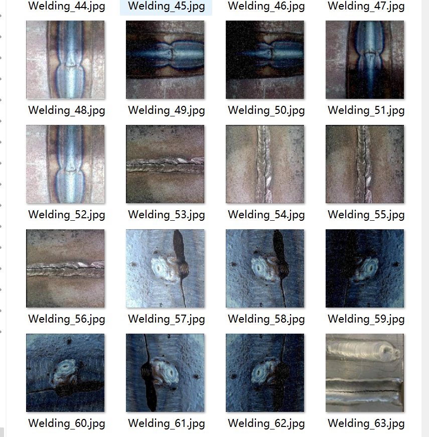
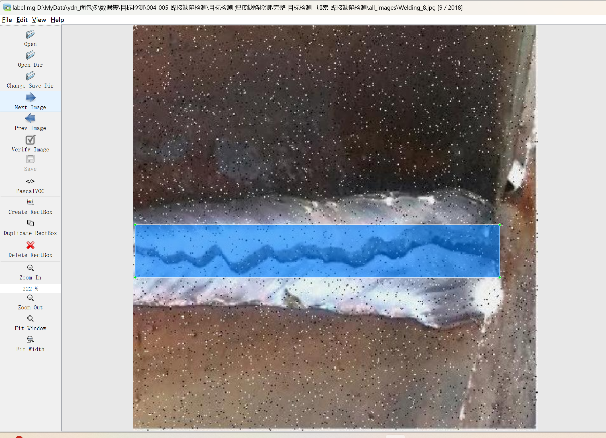

# Welding Defect Detection - Target Detection Dataset

Dataset Information: A total of 2018 images are included along with one-to-one corresponding annotation files.
Annotation files are provided in two formats: VOC formatted XML files and YOLO formatted txt files.
The objects to be detected include the following:
['Defect', 'Bad_Weld', 'Good_Weld']
The number of images per category along with the number of annotated bounding boxes are as follows:
(Annotations are generally labeled in English, and Chinese characters within parentheses are for reference.)
Note: An image may be labeled with multiple objects, so the total number of annotated bounding boxes may exceed the number of images.
The complete dataset consists of three folders and one txt file:
all_images: Stores the dataset's images, screenshots included:
Image size information:
all_txt and classes.txt: Store YOLO formatted txt annotation files, the same number as images, each annotation file corresponds to an individual image.
classes.txt:
For a detailed understanding of the standard YOLO file format, please search for it on your own. In simple terms, the number at index 0 represents the name of the object listed at position 0 in arrays within classes.txt.
all_xml: VOC formatted XML annotation files.
The number and images match, each annotation file corresponds to an individual image.
For a detailed understanding of the VOC formatted standard file, please search for it on your own.
Both formats can be used, choosing either is sufficient.
Annotation screenshots:

## Image

Here is a pay link on Stripe ( https://buy.stripe.com/3cs8yP7sY87d0vu9AB ). Please contact me lonlonago@foxmail.com after funding $89, and I will send you a complete data files , thank you!

